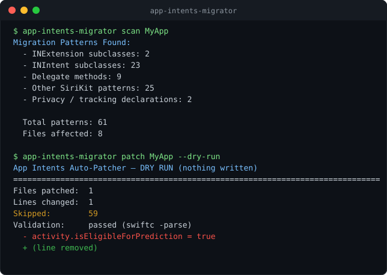

# AppIntentsMigrator

A Swift CLI tool to scan and migrate SiriKit code to App Intents.



## The Problem

App Intents is the framework Apple documents for reaching Siri, Spotlight, Shortcuts and
Apple Intelligence. Apple's own guidance is explicit that Apple Intelligence
["uses the app intents, app entities, and app enums you define"](https://developer.apple.com/documentation/appintents/apple-intelligence-and-siri-ai)
to understand your app. SiriKit is not part of that path.

The failure mode is quiet. SiriKit code keeps compiling and keeps passing CI, so nothing
tells you it is falling behind — it simply isn't what the newer Siri surfaces are built on.
An app whose only integration is an `INExtension` gets none of the App Shortcuts, Spotlight
or Apple Intelligence behaviour that App Intents unlocks.

This tool finds that code and tells you what to replace it with.

> **On the "SiriKit is deprecated" reporting.** Widely circulated articles describe a formal
> SiriKit deprecation at WWDC 2026 and an iOS 27 cut-off. As of 18 August 2026 that is **not
> reflected in Apple's documentation**: querying Apple's documentation API returns
> `deprecated=false` for `INExtension`, `INIntent` and `INPreferences`, and the SiriKit
> framework page carries no deprecation notice. Treat the deadline framing with caution and
> verify against Apple's release notes before planning around a date. The case for migrating
> does not depend on it — App Intents is where the capability is, deprecation or not.

## What It Does

### Scan
Find all SiriKit patterns in your codebase:

```bash
$ app-intents-migrator scan ~/MyProject
Migration Patterns Found:
  - INExtension subclasses: 3
  - INIntent subclasses: 5
  - Delegate methods: 4
  - Other SiriKit patterns: 6
  - Privacy / tracking declarations: 0

  Total patterns: 18
  Files affected: 8
  Files scanned:  42
  Report saved: migration_report.json
```

Swift sources are scanned for SiriKit *calls*; `Info.plist` files are scanned for SiriKit *declarations* (`IntentsSupported`, `NSSiriUsageDescription`, the intents extension point). Comments and string literals are ignored, so commented-out code and code samples inside strings are never reported.

### Suggest
Get before/after code for each pattern:

```bash
$ app-intents-migrator suggest ~/MyProject
[1/14]  INExtension class → AppIntent struct
------------------------------------------------------------------------------
Pattern:     INExtension — INExtension subclass
Complexity:  Manual review
Apple docs:  https://developer.apple.com/documentation/appintents/appintent
Occurrences: 2
  • IntentExtension/IntentHandler.swift:4  class IntentHandler: INExtension {

-- BEFORE (SiriKit) ----------------------------------------------------------
    class IntentHandler: INExtension {
        override func handler(for intent: INIntent) -> Any? {
            guard intent is INSendMessageIntent else { return nil }
            return SendMessageIntentHandler()
        }
    }

-- AFTER (App Intents) -------------------------------------------------------
    struct SendMessage: AppIntent {
        static let title: LocalizedStringResource = "Send Message"

        @Parameter(title: "Recipient") var recipient: String

        func perform() async throws -> some IntentResult {
            try await MessageService.shared.send(message, to: recipient)
            return .result()
        }
    }
```

### Patch
Apply the migrations that can be made safely, with a backup and a validation gate:

```bash
$ app-intents-migrator patch ~/MyProject --dry-run
App Intents Auto-Patcher — DRY RUN (nothing written)
==============================================================================
Files patched:  3
Lines changed:  6
Skipped:        13
Validation:     passed (swiftc -parse)

CHANGES THAT WOULD BE MADE
------------------------------------------------------------------------------
App/AppDelegate.swift:2  [auto swap-intents-import]
  - import Intents
  + import AppIntents

App/AppDelegate.swift:7  [auto drop-siri-authorization]
  - INPreferences.requestSiriAuthorization { status in print(status) }
  + (line removed)
```

**Expect it to change little.** Most of a SiriKit migration is structural — new types, re-modelled parameters, rewritten control flow — and none of that can be done safely by text substitution. Those land in `suggest`, not `patch`.

## How patching stays safe

1. **Backup first.** Every Swift file is archived to `AppIntentsMigrator.backup-YYYY-MM-DD.tar.gz` in the project root before anything is written. If the archive fails, nothing is touched.
2. **Validate before writing.** The patched text is checked with `swiftc -parse` on a temporary copy. A file that fails never reaches your working tree.
3. **Validate again after writing,** across the whole patched set. Any failure restores the backup automatically.
4. **Structural rewrites are opt-in.** They are reported, not applied, unless you pass `--include-structural`.
5. **Swift only.** The patcher refuses any file that is not `.swift`, so `Info.plist` findings are always reported for you to edit by hand.
6. **The import swap goes last.** `import Intents` → `import AppIntents` is only applied once nothing else in that file needs the old module; otherwise it is deferred and reported. Swapping it early would leave every remaining `IN…` symbol unresolved, and a missing symbol still *parses*, so validation would not catch it.

### A caveat worth knowing

`swiftc -parse` is a **syntax** check. It does not catch type mismatches, missing members, or unresolved imports — a class turned into a struct with `override` members still parses cleanly. Passing validation means "still parses", not "still builds".

`--typecheck` opts into the stricter check, but a file compiled outside its module cannot see the rest of your project, and building for the host platform makes `import UIKit` fail. On an iOS project it reports errors that are not real. Use it when applying structural rewrites, and read the failures critically.

**Always build in Xcode after patching.**

## Validated against real projects

Detection is checked against production SiriKit code, not only the bundled sample:

| Project | Swift files | Findings | Files missed vs `grep` |
| --- | --- | --- | --- |
| [Automattic/simplenote-ios](https://github.com/Automattic/simplenote-ios) | 358 | 49 | 0 |
| [LoopKit/Loop](https://github.com/LoopKit/Loop) | 398 | 41 | 0 |

Both scan in about a second. Running against Loop is what surfaced the
`isEligibleForHandoff` bug fixed in the prediction-flag rule.

## Try it without a SiriKit project

`Examples/LegacySiriKitApp` is a deliberately un-migrated SiriKit app — an Intents
extension, generated intent classes, donations, shortcut UI and an `Info.plist`. It
triggers all 22 detection rules.

```bash
swift run app-intents-migrator scan Examples/LegacySiriKitApp
```

See [`Examples/LegacySiriKitApp/README.md`](Examples/LegacySiriKitApp/README.md) for what
each file demonstrates.

### The same app, migrated

[`Examples/MigratedAppIntentsApp`](Examples/MigratedAppIntentsApp) is what the guidance
actually produces — `SendMessage`, `OrderCoffee` with an `AppEnum`, an
`AppShortcutsProvider` and an `IntentDonationManager` donation.

It is not illustrative prose. CI **typechecks it against the real AppIntents framework**
and asserts the scanner finds **zero** patterns in it, so the advice in `CommonPatterns`
cannot quietly drift away from code that compiles:

```bash
xcrun swiftc -typecheck -target arm64-apple-macos14 Examples/MigratedAppIntentsApp/*.swift
swift run app-intents-migrator scan Examples/MigratedAppIntentsApp   # Total patterns: 0
```

## Xcode integration

### Inline warnings in the editor

`--xcode` emits findings in the compiler's diagnostic format, so a Run Script build phase
turns them into warnings on the offending lines:

```bash
app-intents-migrator scan "$SRCROOT" --xcode
```

Add that as a Run Script phase (uncheck *Based on dependency analysis* so it runs every
build), and SiriKit calls are flagged where you are already looking:

```
MyApp/IntentHandler.swift:4: warning: SiriKit: INExtension subclass → INExtension class → AppIntent struct [Manual review]
```

Pass `--warnings-as-errors` to fail the build instead — for teams enforcing the migration
rather than advising it. This works with any `.xcodeproj`; no extension to install.

### Swift package plugin

For package-based projects:

```bash
swift package app-intents-scan
```

Also available from Xcode by right-clicking the package in the navigator. The plugin
declares no write permission, so it can never modify what it inspects — patching stays in
the CLI where the backup and validation gates apply.

> **Why not an Xcode Source Editor Extension?** It is sandboxed to the current editor
> buffer: no access to the project tree and no ability to run `swiftc`. Backups, cross-file
> analysis and syntax validation — the whole safety model — are unavailable there, so it
> would offer strictly less than the build phase above while being harder to install.

## Installation

Clone and build:

```bash
git clone https://github.com/divyaravitech/AppIntentsMigrator.git
cd AppIntentsMigrator
swift build -c release
```

The binary is at `.build/release/app-intents-migrator`.

A Homebrew formula with the v1.0.0 SHA is ready in
[`Formula/app-intents-migrator.rb`](Formula/app-intents-migrator.rb). It needs a
`homebrew-tap` repository to be installable; until that exists, build from source above.
Once published:

```bash
brew install divyaravitech/tap/app-intents-migrator
```

## Usage

### Scan your codebase
```bash
app-intents-migrator scan ~/MyProject
```

Outputs a summary plus a detailed `migration_report.json`.

| Option | Effect |
| --- | --- |
| `--json <path>` | Where to write the JSON report (default `migration_report.json`) |
| `--no-json` | Console output only |
| `--exclude <glob>` | Skip matching paths. Repeatable |
| `--xcode` | Emit Xcode diagnostics for a Run Script build phase |
| `--warnings-as-errors` | With `--xcode`, fail the build on findings |

### Get migration suggestions
```bash
app-intents-migrator suggest ~/MyProject
```

| Option | Effect |
| --- | --- |
| `-o, --output <path>` | Save the report. A `.json` path writes JSON; any other extension writes the text guide |
| `--summary` | Print only the counts, without the guide |
| `--exclude <glob>` | Skip matching paths. Repeatable |

### Apply safe patches
```bash
app-intents-migrator patch ~/MyProject --dry-run
```

| Option | Effect |
| --- | --- |
| `--dry-run` | Show the changes without writing them |
| `--apply` | Write the changes (the default) |
| `--rollback <archive>` | Restore a backup, undoing a previous run |
| `--validate-only` | Only check that the project's Swift files parse |
| `--include-structural` | Also write structural rewrites. These usually need follow-up edits |
| `--typecheck` | Validate with `swiftc -typecheck` instead of `-parse` |
| `-o, --output <path>` | Write the patch report as JSON |
| `--exclude <glob>` | Skip matching paths. Repeatable |

### Excluding paths

Globs are matched against each path relative to the scan root *and* against the file name:

```bash
app-intents-migrator scan ~/MyProject --exclude 'Tests/*' --exclude '*.generated.swift'
```

### Undoing a patch
```bash
app-intents-migrator patch ~/MyProject --rollback ~/MyProject/AppIntentsMigrator.backup-2026-08-13.tar.gz
```

## What's Covered

22 SiriKit → App Intents migrations:
- INExtension classes → AppIntent structs
- INIntent subclasses → new AppIntent definitions
- `handler(for:)` → `perform()`
- `handle(intent:completion:)` → async `perform()`
- `resolve…(for:with:)` → `@Parameter` declarations
- INIntentResolutionResult → async parameter resolution
- INInteraction donation → IntentDonationManager
- INVoiceShortcutCenter → AppShortcutsProvider
- `suggestedInvocationPhrase` → `@AppShortcutsBuilder`
- Info.plist intent lists → Swift declarations
- Privacy manifest updates
- And 11 more...

Each with an Apple documentation link checked against Apple's documentation API.

## Roadmap

- [x] Phase 1: Scanner
- [x] Phase 2: Suggestion Engine
- [x] Phase 3: Auto-patcher (safe mechanical migrations)
- [x] Test suite
- [x] Phase 4: Xcode integration (build-phase diagnostics + package plugin)

## Tests

```bash
swift test
```

35 tests covering the detector (comments, string literals, wrapped signatures, property
lists), the migration library's coverage invariants, the patching safety guards, backup
round-trips, and exclusion globs.

## Requirements

- Swift 5.9+
- macOS 13+

## License

MIT

## Author

Divya Ravi
GitHub: [@divyaravitech](https://github.com/divyaravitech)

---

**SiriKit still compiles. That's exactly why it's easy to miss.**
