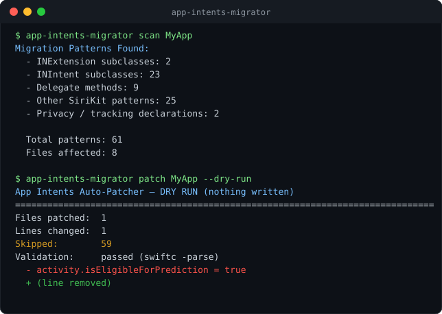

# AppIntentsMigrator

Finds SiriKit code in a Swift project and shows the App Intents replacement for it.



## Why

App Intents is the framework Apple documents for Siri, Spotlight, Shortcuts and Apple
Intelligence. SiriKit isn't part of that path, so an app whose only integration is an
`INExtension` doesn't get App Shortcuts, Spotlight results or Apple Intelligence support.

Nothing breaks when you ignore this. SiriKit still compiles and your tests still pass, so
there's no signal that anything is wrong.

> **On the reports that SiriKit was deprecated at WWDC 2026:** as of 7 October 2026, three
> weeks after iOS 27 shipped, Apple's documentation API still returns `deprecated=false` for
> `INExtension`, `INIntent`, `INPreferences` and `INInteraction`, and the SiriKit framework
> page has no deprecation notice. Check Apple's release notes before planning around a date.

## Install

```bash
brew install divyaravitech/tap/app-intents-migrator
```

Or build it:

```bash
git clone https://github.com/divyaravitech/AppIntentsMigrator.git
cd AppIntentsMigrator && swift build -c release
```

Needs Swift 5.9+ and macOS 13+. The binary ends up at `.build/release/app-intents-migrator`.

## Usage

### scan

```bash
app-intents-migrator scan ~/MyApp
```

```
Migration Patterns Found:
  - INExtension subclasses: 3
  - INIntent subclasses: 5
  - Delegate methods: 4
  - Other SiriKit patterns: 6
  - Privacy / tracking declarations: 0

  Total patterns: 18
  Files affected: 8
  Files scanned:  42
```

Reads `.swift` files for SiriKit calls and `Info.plist` for SiriKit declarations
(`IntentsSupported`, `NSSiriUsageDescription`, the intents extension point). Files are
parsed with swift-syntax first, so comments and string literals are never matched.

| Option | |
| --- | --- |
| `--json <path>` | JSON report location (default `migration_report.json`) |
| `--no-json` | Console only |
| `--xcode` | Emit Xcode diagnostics (see below) |
| `--warnings-as-errors` | With `--xcode`, fail the build |
| `--exclude <glob>` | Skip paths. Repeatable |

### suggest

```bash
app-intents-migrator suggest ~/MyApp
```

Prints before/after code, an explanation and an Apple docs link for each pattern found.
22 migrations are covered.

| Option | |
| --- | --- |
| `-o, --output <path>` | `.json` writes JSON, anything else writes the text guide |
| `--summary` | Counts only |
| `--exclude <glob>` | Skip paths. Repeatable |

### patch

```bash
app-intents-migrator patch ~/MyApp --dry-run
```

Applies only the rewrites that are safe to make mechanically. In practice that's import
swaps and a couple of deletions; everything structural is reported by `suggest` instead.

| Option | |
| --- | --- |
| `--dry-run` | Show changes without writing |
| `--apply` | Write changes (default) |
| `--rollback <archive>` | Restore a backup |
| `--validate-only` | Just check the project parses |
| `--include-structural` | Also write structural rewrites. These need follow-up edits |
| `--typecheck` | Validate with `swiftc -typecheck` instead of `-parse` |
| `-o, --output <path>` | JSON patch report |
| `--exclude <glob>` | Skip paths. Repeatable |

## How patching avoids breaking things

1. Every Swift file is archived to `AppIntentsMigrator.backup-YYYY-MM-DD.tar.gz` in the
   project root before anything is written. If that fails, nothing is touched.
2. Patched text is checked with `swiftc` on a temp copy. A file that fails never reaches
   your working tree.
3. The patched set is checked again after writing. Any failure restores the backup.
4. Structural rewrites are reported, not applied, unless you pass `--include-structural`.
5. Non-`.swift` files are refused, so `Info.plist` findings are always yours to edit.
6. `import Intents` is only swapped once nothing else in the file needs it. Swapping early
   leaves the remaining `IN…` symbols unresolved, and that still parses.

`swiftc -parse` only checks syntax. It won't catch type errors or unresolved imports, so a
passing validation means the file parses, not that the project builds. `--typecheck` is
stricter but reports false errors for files that need the rest of the module or a non-host
SDK. Build in Xcode after patching.

## Xcode

`--xcode` prints compiler-format diagnostics, so a Run Script build phase turns findings
into warnings on the right lines:

```bash
app-intents-migrator scan "$SRCROOT" --xcode
```

```
MyApp/IntentHandler.swift:4: warning: SiriKit: INExtension subclass → INExtension class → AppIntent struct [Manual review]
```

Uncheck *Based on dependency analysis* so it runs every build. Works with any `.xcodeproj`.

For Swift packages there's also a command plugin:

```bash
swift package app-intents-scan
```

It declares no write permission, so it can't modify what it inspects.

A Source Editor Extension would be the obvious alternative, but it only sees the current
editor buffer and can't run `swiftc`, so backups, cross-file analysis and validation aren't
possible there.

## Examples

`Examples/LegacySiriKitApp` is an un-migrated SiriKit app that triggers all 22 rules.
`Examples/MigratedAppIntentsApp` is what the suggestions produce, and it's compiled in CI
so the recommended output can't drift from what actually builds.

```bash
swift run app-intents-migrator scan Examples/LegacySiriKitApp
```

## Checked against

| Project | Swift files | Findings |
| --- | --- | --- |
| [simplenote-ios](https://github.com/Automattic/simplenote-ios) | 358 | 49 |
| [Loop](https://github.com/LoopKit/Loop) | 398 | 41 |
| [zpod](https://github.com/ezigus/zpod) | 464 | 36 |

Cross-checked against `grep`, nothing was missed. Running it on Loop is what turned up a bug
where the patcher wanted to delete `isEligibleForHandoff = false`, which would have
re-enabled Handoff.

## Tests

```bash
swift test
```

46 tests over the detector (comments, string and regex literals, interpolation, CRLF/CR
line endings, wrapped signatures, property lists), the migration library, the patching
guards, backup round-trips and exclusion globs.

## Contributing

See [CONTRIBUTING.md](CONTRIBUTING.md). The most useful thing to report is a real SiriKit
pattern this gets wrong. Rules are matched per line, so unusual code shapes are where it
fails.

## License

MIT
